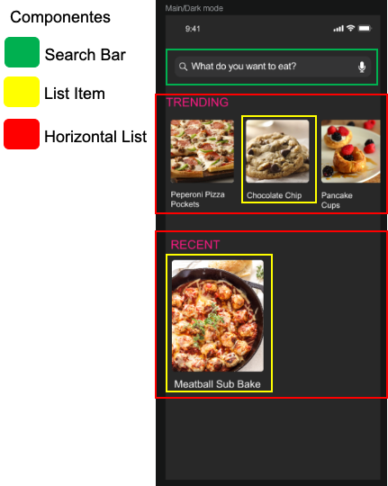

- [App Recetario de cocina](#-app-recetario-de-cocina)
- [Palabras clave](#key-palabras-clave)
- [Objetivo](#-objetivo)
- [Instrucciones](#-instrucciones)
- [Entregables](#-entregables)
- [Tecnologías](#-tecnologías)
- [Requerimientos funcionales](#computer-requerimientos-funcionales)
  - [Obligatorios](#obligatorios)
  - [Opcionales](#opcionales)
  - [Diseño](#diseño)
- [Requerimientos no-funcionales](#-requerimientos-no-funcionales)
- [Flujo de trabajo sugerido](#bulb-flujo-de-trabajo-sugerido)
  - [Demo](#demo)
- [Indicadores de cumplimiento](#-indicadores-de-cumplimiento)
- [Recursos](#-recursos)
  
# 🚀 App Recetario de cocina

- **Organización.** [Equipo (3-4 integrantes)](https://github.com/BrightCoders-Institute/handbook/wiki/Actividades#actividades-en-equipo-sincr%C3%B3nicas)
- **Modo.** [Síncrono](https://github.com/BrightCoders-Institute/handbook/wiki/Actividades#actividades-en-equipo-sincr%C3%B3nicas)
- **Estrategia.** [Mob programming](https://github.com/BrightCoders-Institute/handbook/wiki/Mob-Programming)
- **Duración.** 8 días
- **Dedicación.** 2.5 horas diarias (20 horas total)

# :key: Palabras clave

`React Native`, `Programación por componentes`, `Componentes reutilizables`, `Interfaces para aplicaciones móviles`, `Diseño y construcción de pantallas interactivas`, `Trabajo en equipo`, `Colaboración`, `Mob Programming`, `Buenas prácticas de desarrollo de software`, `Herramientas de análisis de código estático (Codacy, CodeClimate, CodeCov)`, `Pruebas unitarias`, `Herramientas de control de versiones (Git, GitHub)`, `Resolución de problemas`, `Toma de decisiones`, `Principios SOLID`, `Estructuración del código orientada a objetos`, `Métodos pequeños y cohesivos`, `Commits significativos y colaborativos`, `React Native`, `JavaScript o TypeScript`, `ESLint`, `Jest`

# 🎯 Objetivo

Esta actividad tiene compo objetivos:

- Iniciar en la programación con React Native, proporcionando una introducción práctica a la creación de aplicaciones móviles.
- Familiarizar con el modelo de programación por componentes de React Native, enseñándoles a crear y utilizar componentes reutilizables.
- Introducir el desarrollo de interfaces para aplicaciones móviles utilizando React Native, enseñando a los participantes a diseñar y construir pantallas interactivas y atractivas.
- Fomentar el trabajo en equipo y la colaboración utilizando la dinámica de mob programming, donde todos los participantes contribuyen activamente y se rotan en la tarea de realizar commits en el repositorio de código.
- Aplicar buenas prácticas de desarrollo de software, incluyendo el uso de herramientas de análisis de código estático (Codacy, CodeClimate, CodeCov).
- Promover la escritura de pruebas unitarias para asegurar la funcionalidad y la robustez de la aplicación móvil desarrollada.
- Introducir el uso de herramientas de control de versiones (como Git y GitHub).
- Desarrollar habilidades de resolución de problemas y toma de decisiones a medida que los participantes enfrentan desafíos técnicos y toman decisiones de diseño durante el desarrollo de la aplicación móvil.
- Fomentar la adherencia a los principios SOLID en el diseño y la implementación del código fuente, promoviendo la estructuración del código orientado a objetos y la creación de métodos pequeños y cohesivos.
- Fomentar la práctica de commits significativos y colaborativos, donde todos los participantes activos sean registrados como co-autores en los commits y se observen rotaciones frecuentes para realizar los commits.

# 📋 Instrucciones

- El equipo deberá trabajar de manera colaborativa aplicando la dinámica de mob programming para desarrollar la aplicación móvil.
- Durante el proceso de desarrollo en Github, se debe garantizar la participación de todos los miembros del equipo.
- En cada commit realizado en el repositorio de Github, es necesario registrar a todos los participantes activos como co-autores (co-author commits) para documentar su contribución.
- Al realizar los commits, es importante aplicar los conceptos relacionados con los commits significativos, asegurándose de que cada commit represente un cambio lógico y coherente en el código.
- Para fomentar la colaboración y distribuir las responsabilidades, se recomienda rotar la persona encargada de hacer los commits, de manera que no siempre sea la misma persona la que realice los commits. Esto ayudará a garantizar la participación equitativa de todos los miembros del equipo y promoverá un mayor nivel de conocimiento compartido en el proyecto.

# 📥 Entregables

1. Código fuente en el repositorio:
   - Subir el código fuente completo de la aplicación en el repositorio designado.
   - Organizar el código de manera estructurada y legible, siguiendo las mejores prácticas de desarrollo.
   - Asegurar que el código esté actualizado y refleje la versión final de la aplicación.

2. Archivo README.md actualizado:
   - Actualizar el archivo README.md con información relevante sobre el proyecto.
   - Incluir instrucciones claras y detalladas sobre cómo configurar y ejecutar la aplicación.
   - Proporcionar una descripción concisa de la funcionalidad y características clave de la aplicación.
   - Documentar los requisitos de instalación y las dependencias necesarias.
   - Proporcionar ejemplos de uso y capturas de pantalla si es posible.
   - Incluir información sobre cómo contribuir al proyecto y cómo ponerse en contacto con el equipo de desarrollo.

3. Pruebas unitarias:
   - Desarrollar y agregar pruebas unitarias para todas las funcionalidades y componentes principales de la aplicación.
   - Asegurar que las pruebas cubran los casos de uso más importantes y los posibles escenarios de error.
   - Ejecutar las pruebas para verificar que todas las funcionalidades estén implementadas correctamente y sin errores.
   - Incluir los resultados de las pruebas en la documentación y el informe final.

4. Puntuación de los analizadores de código estático:
   - Configurar y ejecutar herramientas de análisis de código estático como Codacy, CodeClimate o similares.
   - Asegurarse de obtener una puntuación de A (o equivalente) en la evaluación realizada por estas herramientas.
   - Resolver los problemas y sugerencias identificados por los analizadores de código estático para mejorar la calidad del código.
   - Incluir los badges o insignias correspondientes en el archivo README.md, mostrando la puntuación y el estado actual del análisis de código estático.

5. Versión final en la rama principal:
   - Asegurarse de que la versión final y estable del código esté fusionada y disponible en la rama principal del repositorio.
   - Realizar una revisión final para verificar que todos los cambios y actualizaciones estén reflejados correctamente en la rama principal.
   - Actualizar el archivo README.md para indicar claramente que la versión en la rama principal es la versión final y estable del código.

# 🛠 Tecnologías

- JavaScript o TypeScript
- React Native
- ESLint (para mantener un estilo de código estandarizado)
- Jest (para realizar pruebas unitarias)
- Codacy, CodeClimate, CodeCov (herramientas de análisis de código estático)

# :computer: Requerimientos funcionales

La empresa Foo Corp necesita una App para poder visualizar las recetas de cocina de sus restaurantes. La App deberá cumplir con los siguientes requerimientos:

## Obligatorios

Pantalla principal:

- Mostrar un listado de recetas de cocina que están de moda (trending).
- Mostrar un listado de las recetas más recientes.
- Para cada receta, se debe mostrar una foto del platillo y el nombre de la receta.

Pantalla de detalle:

- Mostrar la foto del platillo de la receta seleccionada.
- Mostrar la categoría de la receta, indicando si pertenece a la sección de trending o recent.
- Mostrar el nombre de la receta.
- Mostrar la cantidad de porciones por receta (servings).
- Mostrar un listado de ingredientes con su nombre y cantidad requerida.
- Incluir un botón "Me gusta" que permita al usuario etiquetar las recetas como favoritas.

## Opcionales

Adicionalmente, se pueden considerar los siguientes elementos para mejorar los requerimientos:

- Implementar funcionalidades de búsqueda y filtrado de recetas en la pantalla principal.
- Permitir a los usuarios agregar comentarios o reseñas a las recetas.
- Incluir la opción de guardar recetas como favoritas para acceder fácilmente a ellas en una sección separada.
- Integrar la capacidad de compartir recetas a través de redes sociales u otras plataformas de mensajería.
- Agregar opciones de clasificación o etiquetado adicional, como recetas vegetarianas, sin gluten, etc.
- Permitir a los usuarios crear y compartir sus propias recetas dentro de la aplicación.
- Implementar un sistema de notificaciones para informar a los usuarios sobre nuevas recetas, promociones o eventos relacionados con la cocina.

Estos elementos adicionales pueden ser considerados una vez que se cumplan con todos los requerimientos obligatorios y aún quede tiempo para continuar con el reto.

## Diseño

En la carpeta [design](/design) se encuentra el diseño solicitado en formato PNG e Invision.

# 🚨 Requerimientos no-funcionales

- **Base de datos**:
  - Los datos de las recetas se obtendrán de un archivo local en formato JSON.
  - Se debe implementar un mecanismo de lectura y parseo del archivo JSON para obtener la información de las recetas.

- **Calidad**:
  - El código de la aplicación debe seguir un estilo de código estandarizado, el cual será revisado y asegurado mediante el uso de Eslint u herramientas similares.
  - Se debe lograr una puntuación **A** en herramientas de análisis de código estático como CodeClimate o similares. Esto implica mantener un código limpio, legible y bien estructurado.

- **Ejecución**:
  - La aplicación debe ser compatible con los sistemas operativos Android y/o iOS.
  - Se deben realizar pruebas exhaustivas en ambos sistemas para garantizar un funcionamiento correcto y sin problemas.

- **Código fuente**:
  - El código fuente de la aplicación debe seguir el paradigma de programación orientada a objetos (OOP).
  - Se deben aplicar los principios SOLID (Single Responsibility, Open/Closed, Liskov Substitution, Interface Segregation, Dependency Inversion) para lograr un diseño modular, mantenible y extensible.
  - Los métodos deben ser pequeños y enfocados en una única responsabilidad, siguiendo el principio de "una función, una tarea".
  - Se debe evitar la duplicación de código y promover la reutilización mediante la creación de componentes y funciones modulares.

# :bulb: Flujo de trabajo sugerido

A continuación se presenta un flujo de trabajo sugerido para el desarrollo de la aplicación. Si el equipo decide seguir otro enfoque, es válido siempre y cuando se logre el mismo resultado:

1. **Creación de componentes reutilizables**:
   - Identificar los componentes necesarios para la pantalla principal y la pantalla de detalle según los requerimientos.
   - Desarrollar componentes reutilizables que cumplan con las funcionalidades requeridas.
   - Probar y asegurarse de que los componentes funcionen correctamente de manera independiente.

2. **Implementación de la pantalla principal**:
   - Crear la pantalla principal que muestre el listado de recetas de cocina que están de moda y las más recientes.
   - Integrar los componentes desarrollados anteriormente para mostrar la foto y el nombre de cada receta.
   - Realizar pruebas exhaustivas para asegurar el correcto funcionamiento de la pantalla principal.

3. **Implementación de la pantalla de detalle**:
   - Desarrollar la pantalla de detalle que muestre la información completa de una receta seleccionada.
   - Utilizar los componentes reutilizables para mostrar la foto, categoría, nombre, porciones y listado de ingredientes.
   - Agregar el botón "Me gusta" para que los usuarios puedan etiquetar las recetas como favoritas.
   - Verificar que la pantalla de detalle funcione correctamente y se muestre la información adecuada.

4. **Integración y pruebas**:
   - Integrar la pantalla principal y la pantalla de detalle en la navegación de la aplicación.
   - Realizar pruebas de integración para asegurar que todas las funcionalidades se ejecuten sin problemas.
   - Corregir cualquier error o problema identificado durante las pruebas.

5. **Optimización y pulido**:
   - Optimizar el rendimiento de la aplicación, revisando y ajustando el código para garantizar una ejecución eficiente.
   - Mejorar la interfaz de usuario y la experiencia del usuario, teniendo en cuenta el diseño y la usabilidad.
   - Asegurar que la aplicación se adapte correctamente a diferentes tamaños de pantalla y orientaciones.

## Demo

# ✅ Indicadores de cumplimiento

1. **Dominio de React Native:**
   - ¿Los participantes han adquirido conocimientos prácticos en el desarrollo de aplicaciones móviles utilizando React Native?
   - ¿Son capaces de crear componentes reutilizables y utilizar el modelo de programación por componentes de React Native?
   - ¿Han demostrado comprensión de los conceptos fundamentales de React Native, como el enrutamiento de navegación y el manejo de estado?

2. **Desarrollo de interfaces interactivas y atractivas:**
   - ¿Los participantes son capaces de diseñar y construir pantallas interactivas y atractivas para aplicaciones móviles?
   - ¿Han utilizado correctamente los componentes de React Native para crear interfaces intuitivas y visualmente atractivas?
   - ¿Han aplicado principios de diseño de UI/UX para mejorar la experiencia del usuario?

3. **Trabajo en equipo y colaboración mediante Mob Programming:**
   - ¿El equipo ha trabajado de manera colaborativa aplicando la dinámica de Mob Programming?
   - ¿Todos los miembros del equipo han participado activamente en la programación conjunta y se han turnado en la tarea de realizar commits en el repositorio de código?
   - ¿La colaboración y el trabajo en equipo han sido efectivos para desarrollar la aplicación móvil?

4. **Aplicación de buenas prácticas de desarrollo de software:**
   - ¿Se han aplicado buenas prácticas de desarrollo de software, como el uso de herramientas de análisis de código estático (Codacy, CodeClimate, CodeCov)?
   - ¿El código fuente cumple con los estándares de calidad y está organizado de manera estructurada y legible?
   - ¿Se han seguido los principios SOLID en el diseño y la implementación del código fuente?

5. **Desarrollo de pruebas unitarias:**
   - ¿Se han desarrollado pruebas unitarias exhaustivas que cubren todas las funcionalidades y componentes principales de la aplicación?
   - ¿Las pruebas unitarias son efectivas para garantizar la funcionalidad y la robustez de la aplicación móvil desarrollada?
   - ¿Se han utilizado herramientas y frameworks de pruebas adecuados para React Native, como Jest?

6. **Uso correcto de herramientas de control de versiones (Git y GitHub):**
   - ¿Se ha utilizado correctamente Git y GitHub para el control de versiones y la colaboración en el proyecto?
   - ¿Se han realizado commits con co-autores para reconocer la contribución de múltiples personas en el desarrollo del proyecto?
   - ¿El repositorio en GitHub refleja el progreso y las contribuciones de todos los miembros del equipo?

7. **Cumplimiento de los requerimientos funcionales y no funcionales:**
   - ¿La aplicación móvil cumple con todos los requerimientos obligatorios establecidos, como la visualización de recetas, la pantalla principal y la pantalla de detalle?
   - ¿Se han considerado e implementado correctamente los elementos opcionales, como la búsqueda, los comentarios, la opción de guardar recetas, etc.?
   - ¿Se ha cumplido con los requerimientos no funcionales, como la lectura de datos desde un archivo JSON, la calidad del código y la ejecución en sistemas operativos Android y/o iOS?

# 📚 Recursos

- [Trabajo por componentes](https://brightcoders-2.gitbook.io/brightcoders-handbook/recursos/react-native/fundamentos#trabajo-por-componentes)
- [CLI, React Navigation, Hooks y Debugging](https://brightcoders-2.gitbook.io/brightcoders-handbook/recursos/react-native/fundamentos#otros-temas)
- [Herramientas para evaluar la calidad del código](https://brightcoders-2.gitbook.io/brightcoders-handbook/recursos/react-native/herramientas#calidad-del-codigo)
- [Código limpio: principios](https://brightcoders-2.gitbook.io/brightcoders-handbook/codigo-limpio/principios)
